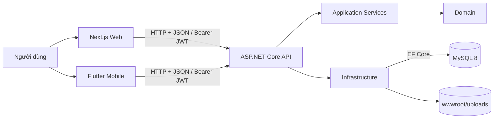
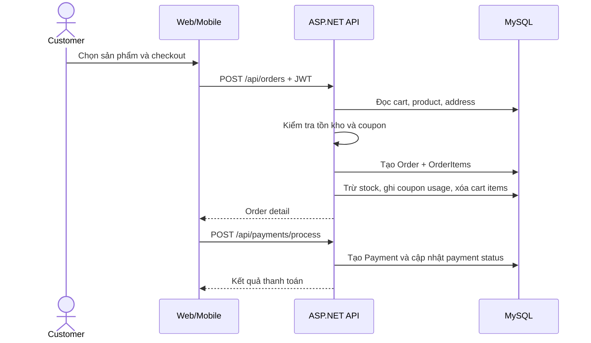

# ShopVN E-Commerce Monorepo

Dự án thương mại điện tử full-stack dùng để học phát triển phần mềm và thực hành DevOps. Repository gồm REST API ASP.NET Core, website Next.js, ứng dụng Flutter và các workflow GitHub Actions để kiểm tra/build/push Docker image.

> Trạng thái hiện tại phù hợp cho local/lab. Trước khi public lên Internet cần xử lý các mục trong [Checklist production](#checklist-production).

## 1. Tổng quan

| Thành phần | Công nghệ | Vai trò | Cổng local mặc định |
|---|---|---|---|
| Backend | ASP.NET Core 8, EF Core, Clean Architecture | REST API, nghiệp vụ, JWT, migration/seed | `5207` khi chạy source, `8080` khi chạy Docker |
| Database | MySQL 8 | Lưu dữ liệu nghiệp vụ | `3306` local hoặc `3307` từ host khi chạy Compose |
| Web | Next.js 15, React 19, TypeScript, Tailwind CSS 4 | Storefront và trang quản trị | `3000` |
| Mobile | Flutter, Riverpod, Dio, GoRouter | Ứng dụng mua hàng đa nền tảng | phụ thuộc emulator/device |
| CI/CD | GitHub Actions, Docker, Docker Hub | Build code, build image, push image | — |

Chức năng chính:

- Đăng ký, đăng nhập, access token/refresh token, đổi và đặt lại mật khẩu.
- Phân quyền `Admin`, `Staff`, `Customer`.
- Sản phẩm, danh mục, thương hiệu, ảnh sản phẩm, tìm kiếm và phân trang.
- Giỏ hàng, địa chỉ, mã giảm giá, đặt/hủy đơn và quản lý tồn kho.
- Thanh toán COD, chuyển khoản và thanh toán online giả lập.
- Wishlist, review, hồ sơ người dùng.
- Dashboard, báo cáo, quản lý khách hàng/đơn hàng/thanh toán/cài đặt cho admin.

## 2. Kiến trúc hệ thống



Backend áp dụng Clean Architecture theo hướng phụ thuộc:

```text
ECommerce.API -> ECommerce.Application -> ECommerce.Domain
     |                    |
     +--> ECommerce.Infrastructure
ECommerce.Application -> ECommerce.Shared
```

- `Domain`: entity, enum, interface repository, domain exception; không chứa giao diện HTTP.
- `Application`: DTO, validator, mapping, interface và service xử lý use case.
- `Infrastructure`: EF Core/MySQL, repository, JWT, BCrypt, file storage, migration và seed.
- `API`: controller, dependency injection, authentication/authorization, Swagger, CORS và global exception middleware.
- `Shared`: response/pagination model và helper dùng chung.

Frontend dùng App Router. Axios interceptor gắn JWT, thử refresh token và gửi lại request khi gặp `401`. Zustand giữ trạng thái auth/cart; Next middleware bảo vệ các route khách hàng và `/admin`. Việc phân quyền thực sự vẫn được backend kiểm tra bằng `[Authorize]`.

Mobile được chia gần theo feature + data/domain/presentation, dùng Dio để gọi API, secure storage để lưu token, Riverpod quản lý state và GoRouter quản lý điều hướng.

## 3. Cấu trúc repository

```text
Ecommerce/
├── .github/workflows/
│   ├── backend-ci.yml             # restore + build backend
│   ├── backend-docker.yml         # kiểm tra Docker build
│   └── backend-docker-push.yml    # build + push Docker Hub
├── ECommerceBackend/
│   ├── src/
│   │   ├── ECommerce.API/
│   │   ├── ECommerce.Application/
│   │   ├── ECommerce.Domain/
│   │   ├── ECommerce.Infrastructure/
│   │   └── ECommerce.Shared/
│   ├── docker-compose.yml
│   └── ECommerce.sln
├── ecommerce-frontend/            # Next.js storefront + admin
└── ecommerce_mobile/              # Flutter app
```

## 4. Luồng hoạt động

### Đăng nhập và refresh token

1. Client gửi email/password đến `POST /api/auth/login`.
2. Backend kiểm tra user và mật khẩu BCrypt, sau đó tạo access token ngắn hạn và refresh token.
3. Refresh token được lưu trong MySQL; client lưu token để gửi `Authorization: Bearer <access-token>`.
4. Khi web nhận `401`, Axios chỉ thực hiện một lần refresh, xếp hàng các request đang chờ rồi retry chúng với token mới.
5. Backend rotate refresh token: revoke token cũ và tạo token mới. Logout cũng revoke refresh token.

### Đặt hàng



Đơn chỉ được khách hủy ở trạng thái `Pending`; khi hủy, số lượng sản phẩm được hoàn lại. COD/chuyển khoản giữ `Pending`, còn online payment hiện giả lập thành công và chuyển thẳng sang `Paid`.

### Upload ảnh

Client gửi `multipart/form-data`; `FileStorageService` kiểm tra phần mở rộng/kích thước rồi lưu file dưới `wwwroot/uploads`. ASP.NET Static Files phục vụ lại URL `/uploads/...`. Đây là local filesystem nên phải gắn persistent volume hoặc chuyển sang object storage khi triển khai nhiều replica.

### Dữ liệu và seed

Khi API khởi động, `DatabaseSeeder` tự chạy EF Core migration và seed nếu bảng user chưa có dữ liệu:

- admin: `admin@ecommerce.com` / `Admin@123`
- category/brand/product mẫu
- coupon: `WELCOME10`
- store settings và cart cho admin

Không dùng tài khoản/mật khẩu seed này ở production.

## 5. Chạy nhanh bằng Docker Compose

### Yêu cầu

- Docker Desktop hoặc Docker Engine có Compose v2.
- Các cổng `3307` và `8080` đang trống.

Compose hiện quản lý **MySQL + backend API**, chưa chứa frontend/mobile. Image backend có tên dựa trên `DOCKER_USERNAME`, vì vậy cần khai báo biến này kể cả khi chỉ build local.

PowerShell:

```powershell
cd ECommerceBackend
$env:DOCKER_USERNAME = "local"
docker compose up --build -d
docker compose ps
docker compose logs -f api
```

Bash:

```bash
cd ECommerceBackend
export DOCKER_USERNAME=local
docker compose up --build -d
docker compose ps
docker compose logs -f api
```

Sau khi MySQL healthy, API migrate và seed database. Truy cập:

- Swagger: <http://localhost:8080/swagger>
- API base: <http://localhost:8080/api>
- MySQL từ host: `localhost:3307`; giữa các container API dùng `mysql:3306`.

Các lệnh vận hành hữu ích:

```bash
docker compose logs -f mysql
docker compose restart api
docker compose down
docker compose down -v   # xóa cả dữ liệu MySQL; chỉ dùng khi muốn reset lab
```

## 6. Chạy từng thành phần ở local

### 6.1 MySQL và backend

Yêu cầu .NET 8 SDK và MySQL 8. Có thể chỉ chạy database bằng container:

```bash
cd ECommerceBackend
docker compose up -d mysql
```

Vì host port của MySQL trong Compose là `3307`, khi API chạy ngoài Docker hãy cấu hình connection string tương ứng. Không sửa/chia sẻ mật khẩu thật trong file tracked; dùng environment variable:

PowerShell:

```powershell
cd ECommerceBackend
$env:ConnectionStrings__DefaultConnection = "Server=localhost;Port=3307;Database=ECommerceDb_Dev;User=ecommerce_user;Password=ecommerce_pass;"
$env:Jwt__Secret = "replace-with-a-long-random-secret-at-least-32-characters"
dotnet restore ECommerce.sln
dotnet run --project src/ECommerce.API
```

Bash:

```bash
cd ECommerceBackend
export ConnectionStrings__DefaultConnection='Server=localhost;Port=3307;Database=ECommerceDb_Dev;User=ecommerce_user;Password=ecommerce_pass;'
export Jwt__Secret='replace-with-a-long-random-secret-at-least-32-characters'
dotnet restore ECommerce.sln
dotnet run --project src/ECommerce.API
```

Theo launch profile, HTTP chạy tại <http://localhost:5207> và Swagger tại <http://localhost:5207/swagger> trong môi trường Development.

Migration được gọi tự động lúc startup. Có thể chạy thủ công:

```bash
dotnet tool install --global dotnet-ef
dotnet ef database update --project src/ECommerce.Infrastructure --startup-project src/ECommerce.API
```

Tạo migration khi thay đổi entity:

```bash
dotnet ef migrations add TenMigration --project src/ECommerce.Infrastructure --startup-project src/ECommerce.API --output-dir Persistence/Migrations
```

### 6.2 Web Next.js

Yêu cầu Node.js 20 (đồng nhất với Dockerfile) và npm.

```bash
cd ecommerce-frontend
npm ci
```

Tạo `ecommerce-frontend/.env.local`:

```dotenv
NEXT_PUBLIC_API_BASE_URL=http://localhost:5207
```

URL không chứa `/api`, vì API client tự nối suffix này.

```bash
npm run dev
# mở http://localhost:3000
```

Kiểm tra production build:

```bash
npm run lint
npm run build
npm start
```

Nếu backend chạy bằng Compose, đổi URL thành `http://localhost:8080`.

### 6.3 Flutter mobile

Yêu cầu Flutter SDK tương thích Dart `^3.12.0`, Android Studio/Xcode tùy nền tảng.

```bash
cd ecommerce_mobile
flutter doctor
flutter pub get
flutter analyze
flutter test
flutter run
```

API URL hiện được compile cứng tại `lib/core/constants/api_constants.dart`:

- Android Emulator gọi API chạy trên máy host: `http://10.0.2.2:5207/api`.
- iOS Simulator thường dùng `http://localhost:5207/api`.
- Thiết bị thật dùng IP LAN của máy chạy backend, ví dụ `http://192.168.1.10:5207/api`; backend phải listen trên interface mạng và firewall phải cho phép cổng.

## 7. API và quyền truy cập

| Nhóm | Endpoint tiêu biểu | Quyền |
|---|---|---|
| Auth | `/api/auth/register`, `login`, `refresh-token` | public |
| Profile/address | `/api/users/profile`, `/api/addresses` | authenticated |
| Catalog | `/api/products`, `/api/categories`, `/api/brands` | đọc public; ghi Admin/Staff |
| Cart/order/payment | `/api/cart`, `/api/orders`, `/api/payments` | authenticated |
| Review/wishlist | `/api/reviews`, `/api/wishlist` | đọc review public; ghi authenticated |
| Coupon | `/api/coupons/validate` | authenticated; CRUD Admin |
| Admin | `/api/admin/**`, báo cáo và settings | Admin/Staff; một số thao tác chỉ Admin |

Response chuẩn:

```json
{
  "success": true,
  "message": "Success",
  "data": {},
  "errors": null
}
```

Xem contract đầy đủ và thử request trực tiếp qua Swagger khi API chạy ở Development.

## 8. Docker và CI/CD hiện có

### Docker image backend

Backend dùng multi-stage build:

1. `sdk:8.0` restore theo từng `.csproj` để tận dụng layer cache.
2. Copy source và `dotnet publish -c Release`.
3. Chỉ copy artifact sang image runtime `aspnet:8.0`, giúp image nhỏ hơn và không chứa SDK.

### Docker image frontend

Frontend cũng dùng multi-stage build: cài dependency → `next build` → copy standalone server sang Node runtime image. Chưa có service frontend trong Compose hiện tại.

### GitHub Actions

| Workflow | Trigger | Nội dung |
|---|---|---|
| `backend-ci.yml` | push/PR vào `main` hoặc `master`, khi backend thay đổi | setup .NET 8, restore, Release build |
| `backend-docker.yml` | push hoặc chạy tay | Docker Compose build |
| `backend-docker-push.yml` | push hoặc chạy tay | login Docker Hub, build và push `latest` |

Để push Docker Hub, cấu hình repository secrets:

- `DOCKER_USERNAME`: username Docker Hub.
- `DOCKER_PASSWORD`: access token Docker Hub, nên dùng token thay cho mật khẩu tài khoản.

Luồng hiện tại:

```text
git push -> GitHub Actions -> build source/image -> Docker Hub :latest
```

Đây mới là CI + publish artifact, chưa phải continuous deployment vì chưa có job cập nhật server.

## 9. Gợi ý deploy trên một VPS

Kiến trúc lab dễ học:

```text
Internet -> DNS -> Nginx/Caddy (TLS)
                    ├── /      -> Next.js:3000
                    └── /api   -> ASP.NET API:8080 -> MySQL private network
```

Quy trình đề xuất:

1. Tạo image backend và frontend, tag bằng Git SHA/version; không chỉ dùng `latest`.
2. Push image lên Docker Hub/GHCR.
3. Trên VPS cài Docker, tạo production Compose riêng và file `.env` chỉ nằm trên server.
4. Không publish cổng MySQL ra Internet; chỉ API truy cập database qua Docker network.
5. Mount named volume cho MySQL và volume/object storage cho uploads.
6. Đặt reverse proxy, domain và TLS Let's Encrypt.
7. Cấu hình CORS đúng domain web, JWT secret mạnh, connection string và các secret qua environment/secret manager.
8. Chạy migration bằng một job/release step có kiểm soát, sau đó rollout container mới.
9. Thêm health check, log collection, metric, alert và backup/restore định kỳ.
10. CD có thể SSH vào VPS để `docker compose pull && docker compose up -d`, nhưng production tốt hơn nên dùng runner/deployment platform và cơ chế rollback rõ ràng.

Ví dụ biến môi trường production tối thiểu:

```dotenv
ASPNETCORE_ENVIRONMENT=Production
ConnectionStrings__DefaultConnection=Server=mysql;Port=3306;Database=ECommerceDb;User=ecommerce_user;Password=<secret>
Jwt__Secret=<random-secret-at-least-32-characters>
Jwt__Issuer=ECommerce.API
Jwt__Audience=ECommerce.Clients
NEXT_PUBLIC_API_BASE_URL=https://api.example.com
```

Lưu ý: biến `NEXT_PUBLIC_*` của Next.js được đóng vào bundle lúc **build image**, không phải chỉ lúc start container.

## 10. Checklist production

Các điểm dưới đây được rút ra từ code hiện tại và nên xem như backlog DevOps/security:

- Di chuyển password MySQL và JWT secret đang nằm trong `appsettings.json`/Compose sang `.env`, GitHub Secrets hoặc secret manager; rotate chúng nếu repository từng public.
- Tắt seed admin mặc định hoặc nhận mật khẩu bootstrap từ secret một lần; không giữ `Admin@123`.
- `Program.cs` tạo policy `AllowNextJs` hard-code và đang dùng policy này; policy `WebAndFlutter` đọc `Cors:AllowedOrigins` được đăng ký nhưng không dùng. Hợp nhất thành một policy cấu hình theo environment.
- Không nuốt lỗi migrate/seed rồi tiếp tục chạy API. Production nên fail fast hoặc tách migration thành release job.
- Mount volume cho `/app/wwwroot/uploads` hoặc dùng S3/MinIO/Azure Blob; container hiện bị recreate sẽ mất file upload.
- Thêm health endpoint cho API và healthcheck cho container API; hiện Compose chỉ kiểm tra MySQL.
- Bổ sung frontend/mobile CI: lint, test, build; backend cũng cần unit/integration test và vulnerability/dependency scan.
- Pin image/tag theo version hoặc Git SHA, thêm SBOM/image scan và quy trình rollback; `latest` không đủ để truy vết release.
- Frontend Dockerfile khai báo `NEXT_PUBLIC_API_URL`, trong khi code đọc `NEXT_PUBLIC_API_BASE_URL`; sửa đồng nhất trước khi build frontend image.
- `next.config.ts` đang fallback về IP LAN `192.168.1.252` và allowlist ảnh theo host cố định; đưa hoàn toàn sang cấu hình deployment.
- Web lưu token trong `localStorage` và cookie role do client tạo. Backend vẫn bảo vệ quyền, nhưng production nên cân nhắc HttpOnly/Secure cookie, CSP và chiến lược chống XSS/CSRF.
- Mobile refresh hiện chưa khớp backend: backend yêu cầu cả `accessToken` và `refreshToken`, đồng thời response được bọc trong `data`; client hiện chỉ gửi refresh token và đọc response ở top-level.
- Thanh toán online, gửi email reset password và thông tin chuyển khoản hiện là mock/chưa hoàn chỉnh; không dùng cho giao dịch thật.
- Thêm rate limiting, audit log, centralized logging, metrics/tracing, database backup và diễn tập restore.

## 11. Lộ trình học DevOps với repository này

1. **Container cơ bản:** chạy MySQL/API, đọc log, inspect network/volume, cố tình restart và kiểm tra persistence.
2. **Configuration & secrets:** bỏ cấu hình nhạy cảm khỏi Git, phân tách dev/staging/prod, dùng `.env` và GitHub Secrets.
3. **CI:** thêm test cho backend, lint/build web, Flutter analyze/test; dùng cache dependency và artifact.
4. **Registry & release:** tag image bằng SemVer + commit SHA, scan lỗ hổng, sinh SBOM, ký image.
5. **CD trên VPS:** production Compose, reverse proxy, HTTPS, healthcheck, rolling/recreate deployment và rollback.
6. **Observability:** structured logs, Prometheus/OpenTelemetry, Grafana và alert cho latency/error/database.
7. **Reliability:** backup MySQL, restore drill, persistent uploads, resource limits và graceful shutdown.
8. **IaC/Kubernetes (nâng cao):** Terraform/Ansible rồi chuyển workload sang Kubernetes với Secret, ConfigMap, Ingress, probes và migration Job.

## 12. Kiểm tra trước khi commit/release

```bash
# Backend
dotnet restore ECommerceBackend/ECommerce.sln
dotnet build ECommerceBackend/ECommerce.sln -c Release --no-restore

# Frontend
cd ecommerce-frontend
npm ci
npm run lint
npm run build

# Mobile
cd ../ecommerce_mobile
flutter pub get
flutter analyze
flutter test

# Docker backend
cd ../ECommerceBackend
DOCKER_USERNAME=local docker compose build api
```

Trên PowerShell, đặt `$env:DOCKER_USERNAME = "local"` trước lệnh Compose thay cho cú pháp inline của Bash.

## Tài liệu liên quan

- Backend chi tiết: [`ECommerceBackend/README.md`](ECommerceBackend/README.md)
- Frontend chi tiết: [`ecommerce-frontend/README.md`](ecommerce-frontend/README.md)
- Các API mobile còn thiếu/đề xuất: [`ecommerce_mobile/docs/MISSING_MOBILE_APIS.md`](ecommerce_mobile/docs/MISSING_MOBILE_APIS.md)
- Ghi chú API phía frontend: [`ecommerce-frontend/docs/MISSING_BACKEND_APIS.md`](ecommerce-frontend/docs/MISSING_BACKEND_APIS.md)

